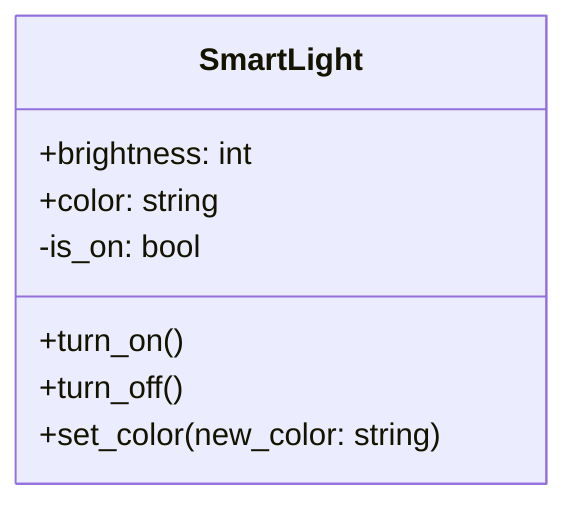
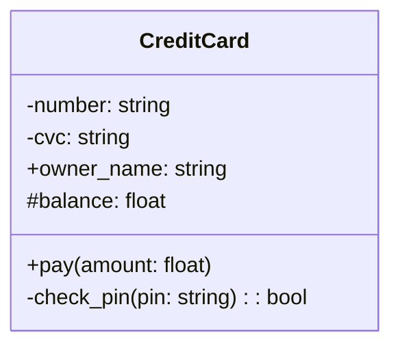
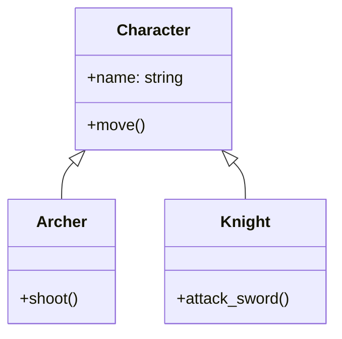
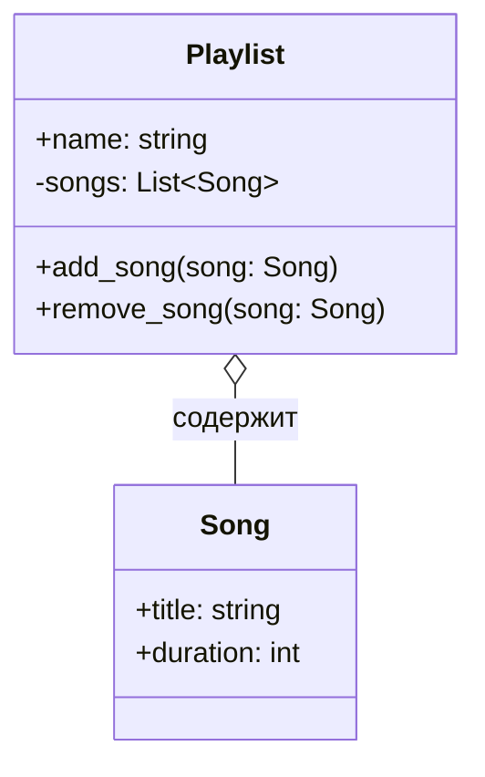
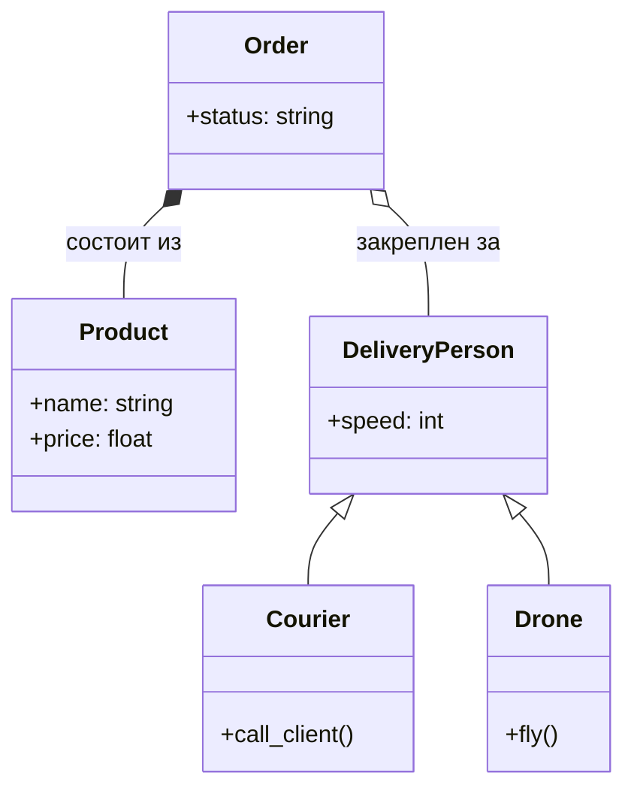
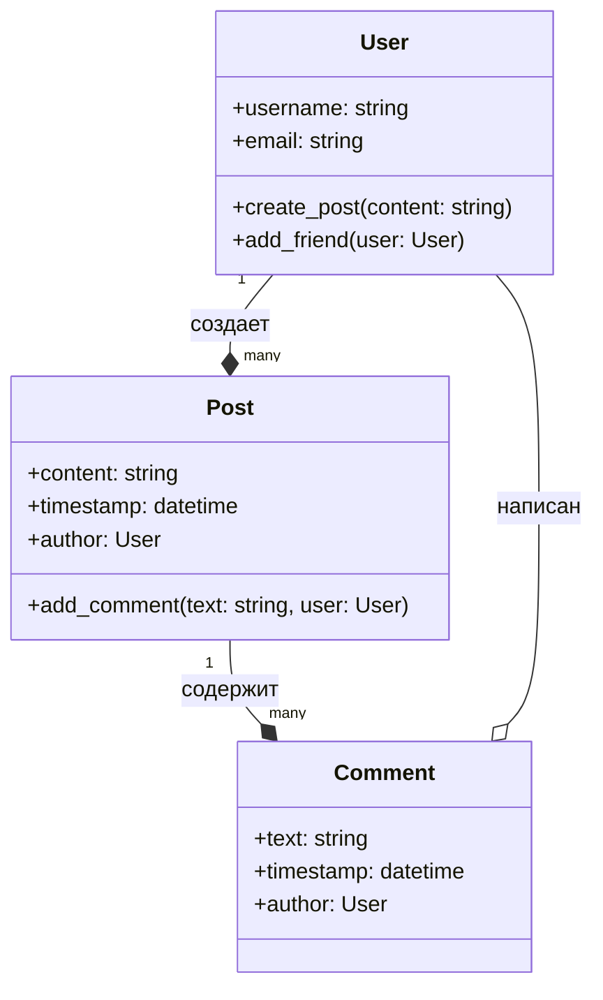

Код для Mermaid

```mermaid
classDiagram
    class SmartLight {
        +brightness: int
        +color: string
        -is_on: bool
        
        +turn_on()
        +turn_off()
        +set_color(new_color: string)
    }
```
Код для Mermaid 2

```mermaid
classDiagram
    class CreditCard {
        -number: string
        -cvc: string
        +owner_name: string
        #balance: float
        
        +pay(amount: float)
        -check_pin(pin: string): bool
    }
```
Код для Mermaid 3

```mermaid
classDiagram
    class Character {
        +name: string
        +move()
    }
    
    class Archer {
        +shoot()
    }
    
    class Knight {
        +attack_sword()
    }
    
    Character <|-- Archer
    Character <|-- Knight
```
Код для Mermaid 4

```mermaid
classDiagram
    class Song {
        +title: string
        +duration: int
    }
    
    class Playlist {
        +name: string
        -songs: List~Song~
        +add_song(song: Song)
        +remove_song(song: Song)
    }
    
    Playlist o-- Song : содержит
```
Код для Mermaid 5 

```mermaid
classDiagram
    class Product {
        +name: string
        +price: float
    }
    
    class Order {
        +status: string
    }
    
    class DeliveryPerson {
        +speed: int
    }
    
    class Courier {
        +call_client()
    }
    
    class Drone {
        +fly()
    }
    
    Order *-- Product : состоит из
    Order o-- DeliveryPerson : закреплен за
    DeliveryPerson <|-- Courier
    DeliveryPerson <|-- Drone
```
Код для Mermaid 6

```mermaid
classDiagram
    class User {
        +username: string
        +email: string
        +create_post(content: string)
        +add_friend(user: User)
    }
    
    class Post {
        +content: string
        +timestamp: datetime
        +author: User
        +add_comment(text: string, user: User)
    }
    
    class Comment {
        +text: string
        +timestamp: datetime
        +author: User
    }
    
    User "1" --* "many" Post : создает
    Post "1" --* "many" Comment : содержит
    Comment o-- User : написан
```
	