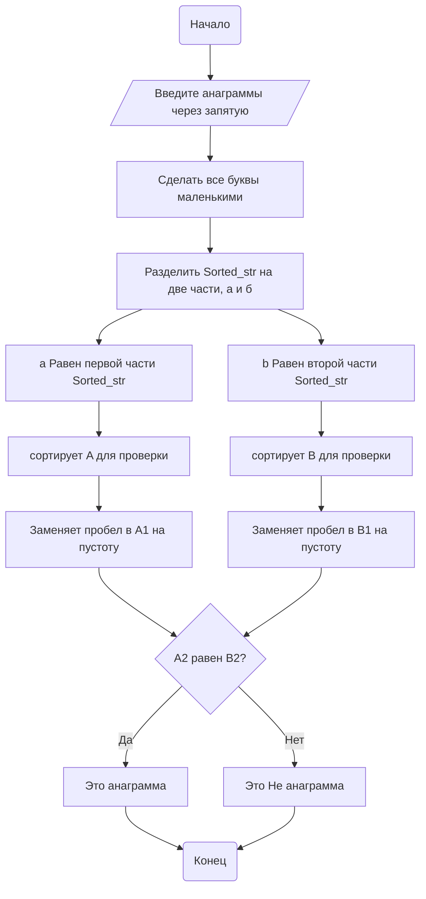

Код для Mermaid

```mermaid
flowchart TD

    Begin(Начало)

    Sorted_str[/Введите анаграммы через запятую/]

    Str[Сделать все буквы маленькими]

    sort[Разделить Sorted_str на две части, а и б]

    A[a Равен первой части Sorted_str]

    B[b Равен второй части Sorted_str]

    A1[сортирует A для проверки]

    B1[сортирует B для проверки]

    A2[Заменяет пробел в A1 на пустоту]

    B2[Заменяет пробел в B1 на пустоту]

    AB{A2 равен B2?}

    AB1[Это анаграмма]

    AB2[Это Не анаграмма]

    End(Конец)

    Begin-->Sorted_str-->Str-->sort

    sort-->A & B

    A-->A1-->A2

    B-->B1-->B2

    A2 & B2-->AB

    AB--Да-->AB1

    AB--Нет-->AB2

    AB1 & AB2-->End
```