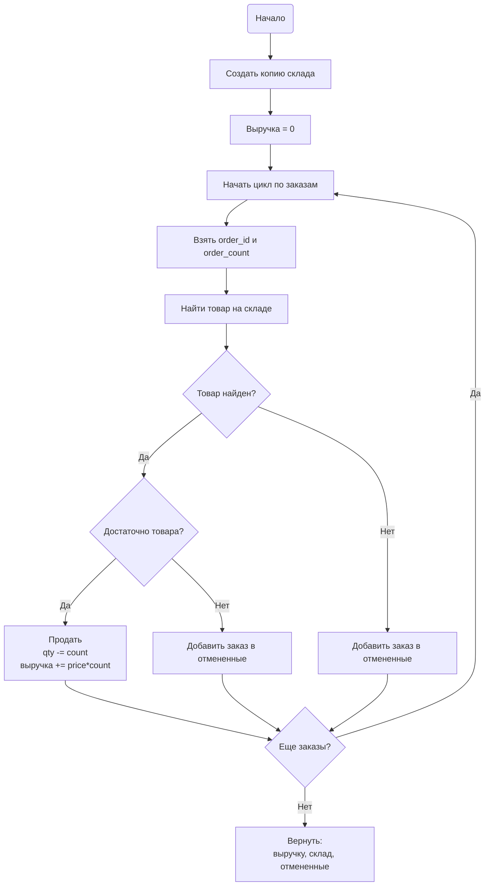

Код для Mermaid

```mermaid
flowchart TD     

    Start(Начало)  --> Copy[Создать копию склада]
    
    Copy --> Init[Выручка = 0]
    
    Init --> Loop[Начать цикл по заказам]
    
    
    Loop --> Get[Взять order_id и order_count]
    
    Get --> Search[Найти товар на складе]
    
    Search --> Found{Товар найден?}
    Found -->|Да| Check{Достаточно товара?}
    Check -->|Да| Sell[Продать<br>qty -= count<br>выручка += price*count]
    Check -->|Нет| Cancel1[Добавить заказ в отмененные]
    
    Found -->|Нет| Cancel2[Добавить заказ в отмененные]
    
    Sell --> Next
    Cancel1 --> Next
    Cancel2 --> Next
    
    Next{Еще заказы?} -->|Да| Loop
    Next -->|Нет| Return[Вернуть:<br>выручку, склад, отмененные]
```